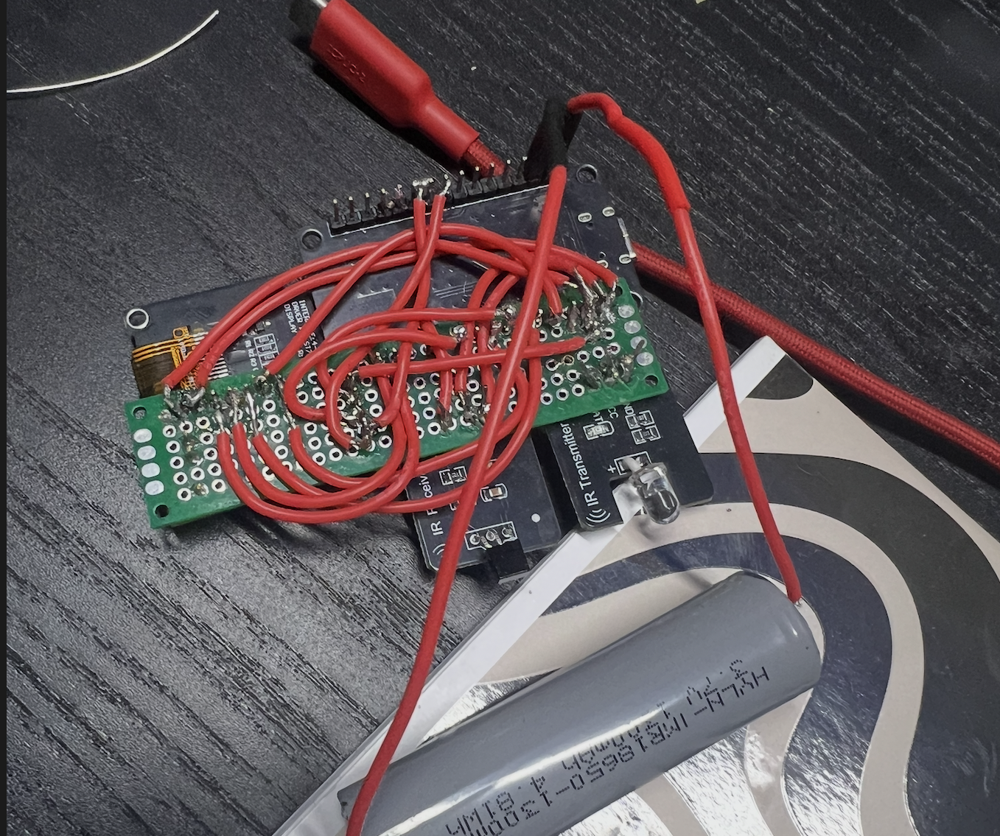
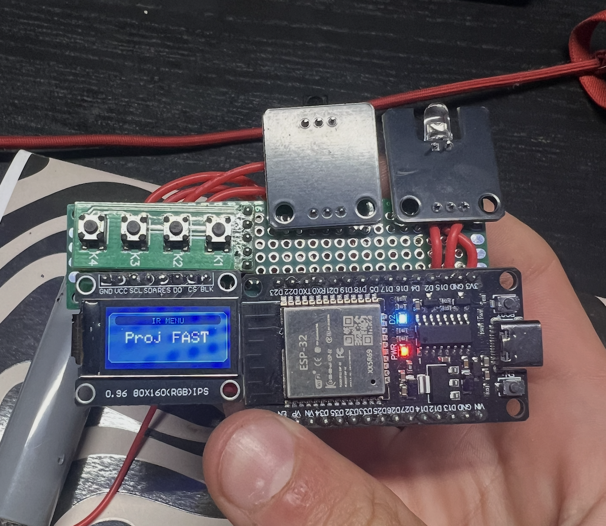

# IR Pilot ESP32

Portable universal IR remote controller built with an ESP32. The device can capture, store and transmit infrared signals, control common TVs and projectors, and provide a small local web panel over Wi-Fi.

## Hardware photos

Current prototype assembled on a breadboard:





## Features

- Capture and save up to 10 IR signals in persistent storage.
- Replay saved IR signals.
- Universal TV control with common brand presets.
- TV and projector preset lists with 20 entries each.
- Fast projector-signal testing mode.
- 160x80 ST7735 TFT user interface.
- Five-button navigation.
- Wi-Fi access point with a local web panel.
- BLE keyboard test and automation mode.
- Dedicated laser output control.

## Hardware

The current firmware targets an `ESP32 DevKit` board and uses the following connections:

| Function | GPIO |
| --- | ---: |
| TFT SCLK | 22 |
| TFT MOSI | 23 |
| TFT reset | 4 |
| TFT chip select | 5 |
| TFT data/command | 2 |
| IR receiver | 21 |
| IR transmitter | 15 |
| IR feedback LED | 16 |
| Laser output | 13 |
| HOME / BOOT button | 0 |
| BACK button | 17 |
| OK / ENTER button | 19 |
| RIGHT button | 32 |
| LEFT button | 25 |

Use a suitable transistor or driver circuit for the laser module. Do not connect a higher-voltage or higher-current laser directly to an ESP32 GPIO. Never point a laser at people, vehicles or aircraft.

## Building and uploading

This project uses PlatformIO and the Arduino framework.

```bash
python3 -m platformio run
python3 -m platformio run -t upload
python3 -m platformio device monitor
```

The default serial monitor speed is `115200` baud.

## Basic operation

The main menu contains options for:

- saving an IR signal,
- sending a saved signal,
- universal TV control,
- TV and projector presets,
- fast projector testing,
- the Wi-Fi web panel,
- laser control,
- BLE keyboard testing.

For the web panel, the ESP32 starts an access point with the default network name `ESP32-IR`. Connect to it and open:

```text
http://192.168.4.1
```

The default access-point password is configured in `src/main.cpp`.

## Project status

The project is still under active development. Current work focuses on hardware testing, reliable button input, IR signal compatibility, and improving the user interface.

## Libraries

Dependencies are defined in [`platformio.ini`](platformio.ini):

- Adafruit GFX Library
- Adafruit ST7735 and ST7789 Library
- IRremote
- ESP32 BLE Keyboard
